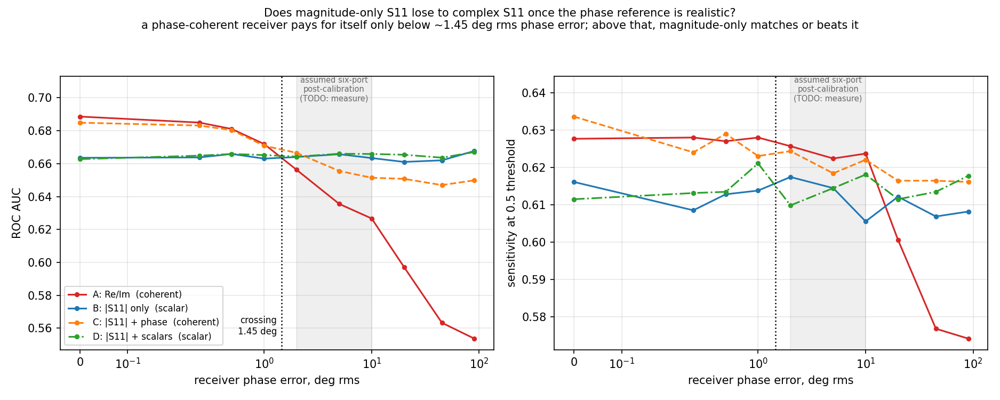

# mwi-layered-sim

Does a low-cost skin-cancer probe need to measure the **phase** of the reflected
microwave signal, or is the **strength** of the reflection (|S11|) enough?

That's a hardware-cost question. Magnitude-only allows a cheap scalar detector.
Phase requires a phase-coherent receiver (a six-port or VNA-style front end), which
costs more in parts and calibration. This repo simulates thousands of virtual patients
to answer it.



## Result

**A phase-coherent receiver helps only if its phase error stays below about 1.45°
rms.** Above that, magnitude-only does as well or better.

- Even with perfect phase, measuring phase gains just +0.025 AUC (0.689 vs 0.664).
- At 26 GHz, 1.45° of phase is about 23 µm of path length, roughly a third of a hair's
  width. Cable flex, temperature, and connector repeatability all move it more than that.
- A six-port after calibration is assumed to reach 2–10° rms, which is past the
  crossing point. **So a scalar detector front end is the recommended choice.**
- Keep both antenna bands (2–12 GHz and 8–26 GHz). Each one alone gets about 0.61 AUC,
  together they get 0.66, and every narrowing tried costs accuracy.

The whole conclusion rests on the 2–10° six-port figure, which **has not been measured
yet**. Measuring it is the most important next step.

## What was checked

- The forward model passes five physics checks (Fresnel, decay, quarter-wave null,
  thin-layer limit, passivity).
- Skin tissue values match the published IFAC/Gabriel database to better than 0.1%
  (fat conductivity is 6% off and flagged).
- The classifier can't cheat: with identical classes it scores exactly chance (0.50).
- The conclusion holds when the tumour contrast is halved or raised by 50%.

## What this model can't tell you

It treats skin as flat, infinite layers hit by a plane wave, with no antenna in the
model. It compares front ends under identical conditions. It does **not** predict
clinical accuracy, and it can't validate the spiral antennas. Several tissue values,
including the tumour contrast, are still marked `TODO_SOURCE`.

## Repository

```
python/    the full, tested experiment (physics + machine learning)
matlab/    the physics half in base MATLAB, no toolboxes needed
results/   figures and metrics from the committed run
docs/      DETAILS.md: complete methods, every result table, limitations
```

**Run the Python version** from the repository root:

```bash
python3 -m venv .venv && .venv/bin/pip install -r python/requirements.txt
./python/run_all.sh
```

**Run the MATLAB version:** open `matlab/demo_physics.m` and press Run.

The full write-up, including sourcing, leakage audits, band ablation, and open
questions, is in [docs/DETAILS.md](docs/DETAILS.md).
